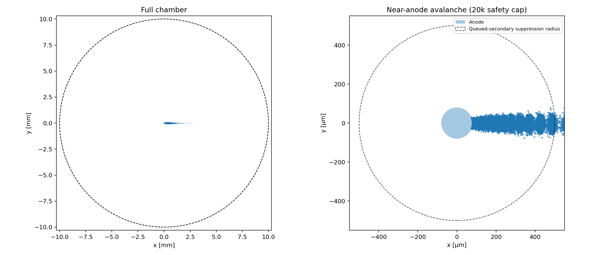
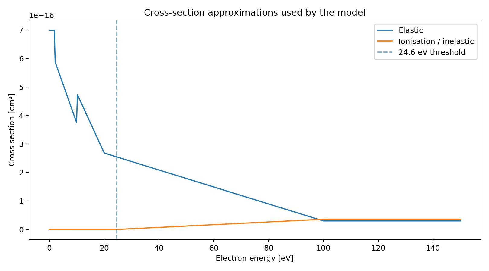

# Monte Carlo Electron Transport in Helium

A compact scientific-computing project that simulates electron transport and avalanche formation in helium inside an ideal cylindrical proportional-counter geometry. The model uses a null-collision Monte Carlo method, energy-dependent elastic and ionisation cross sections, secondary-electron generation, and a Numba-accelerated transport kernel.



**Live Demo Link**: https://monte-carlo-electron-avalanche-szdcuc7dqeuamvzfh67hbk.streamlit.app/

## Why this project

This repository presents the model as a standalone, reproducible scientific-computing project with a clean Python API, tests, literature context, saved example results, and an interactive Streamlit interface.

The project is literature informed and the numerical approach and geometry are closely related to published work on null-collision electron transport and gas multiplication in cylindrical proportional counters, while the cross sections and angular scattering used here remain intentionally simplified.

## Model

The detector is represented by a thin cylindrical anode wire of radius

- `r_a = 8.0e-5 m`

inside a cylindrical cathode of radius

- `r_c = 1.0e-2 m`.

For an ideal long coaxial geometry, end effects are neglected and the electric-field magnitude is

```math
E(r)=\frac{V}{r\ln(r_c/r_a)}.
```

An electron is accelerated toward the anode. Candidate free-flight times are sampled from an exponential distribution using a constant null-collision rate. Elastic collisions randomise the direction while preserving speed; ionisation events reset the transported electron to thermal energy and create a secondary electron at the collision position.

### Simplifications

This is an simplified microscopic transport model, not a detector-calibration package. In particular:

- the helium cross sections are simplified analytic approximations inherited from the original model;
- elastic scattering uses a random forward-hemisphere approximation rather than a measured differential angular distribution;
- the electric field assumes ideal cylindrical symmetry and neglects end effects, support structures, and space charge;
- avalanche growth is deliberately stopped inside `0.5 mm` radius to keep the simulation tractable for interactive use;
- the Streamlit app includes a safety cap on the number of transported electrons.

These limitations are useful future extensions rather than hidden assumptions.

## Literature basis

The implementation draws on several related pieces of literature:

1. **Yousfi, Hennad & Alkaa (1994)**, *Monte Carlo simulation of electron swarms at low reduced electric fields*, **Physical Review E 49, 3264–3273**. The paper develops a Monte Carlo method based on the classical **null-collision technique** and applies it to electron swarms including atomic helium. DOI: [10.1103/PhysRevE.49.3264](https://doi.org/10.1103/PhysRevE.49.3264)

2. **Alkaa, Mitev & Ségur (2007)**, *A fast technique for Monte Carlo simulation of the process of gas multiplication in cylindrical proportional counters*, **Nuclear Instruments and Methods in Physics Research A 580, 161–164**. This is particularly relevant to Monte Carlo gas multiplication in **cylindrical proportional-counter geometry**. DOI: [10.1016/j.nima.2007.05.074](https://doi.org/10.1016/j.nima.2007.05.074)

3. **Kundu & Morton (1999)**, *Numerical simulation of argon–methane gas filled proportional counters*, **Nuclear Instruments and Methods in Physics Research A 422, 286–290**. Although the gas mixture differs, the paper studies single-electron-induced avalanches in cylindrical single-wire proportional counters using Monte Carlo simulation. DOI: [10.1016/S0168-9002(98)00959-0](https://doi.org/10.1016/S0168-9002(98)00959-0)

4. **Khrabrov & Kaganovich (2012)**, *Electron scattering in helium for Monte Carlo simulations*, **Physics of Plasmas 19, 093511**. This provides a more sophisticated treatment of electron–helium differential scattering and is a natural reference for improving the simplified angular-scattering model used here. DOI: [10.1063/1.4751865](https://doi.org/10.1063/1.4751865)

## Interactive demo

The Streamlit interface lets you vary the anode voltage, initial electron radius, random seed, and simulation safety cap, then inspect:

- the near-anode avalanche;
- the full chamber;
- the 3D interaction cloud;
- the elastic and inelastic cross-section approximations;
- a short explanation of the physical model.

Run it locally with:

```bash
pip install -r requirements.txt
streamlit run app.py
```

## Python API

```python
from simulation import simulate_avalanche

result = simulate_avalanche(
    voltage_v=1000,
    start_radius_m=3.0e-3,
    seed=42,
)

print(result.electrons_processed)
print(result.secondary_electrons_created)
print(result.points.shape)
```

With the default 1000 V configuration and seed `42`, the included example run produced 10,174 transported electrons, 10,173 secondary electrons, and 22,986 stored interaction points before reaching the model's avalanche cutoff. Exact timing depends on hardware; the first call also includes Numba compilation overhead.

## Cross-section model



The inelastic channel opens at the helium ionisation threshold used by this model, 24.6 eV. The plotted functions are the simplified cross-section approximations implemented in `simulation.py`.

## Repository structure

```text
monte-carlo-electron-avalanche/
├── README.md
├── simulation.py          # physics + Monte Carlo transport kernel
├── app.py                 # Streamlit interface
├── requirements.txt
├── LICENSE
├── figures/
    ├── avalanche_overview.png
    └── cross_sections.png

```

The project deliberately avoids unnecessary infrastructure: no database, API server, or frontend framework is required for a simulation that can be explored directly in Python and Streamlit.

## Tests

```bash
pytest -q
```

The tests cover the ionisation threshold, positivity of the elastic cross section, the expected `1/r` cylindrical-field scaling, detector geometry, and deterministic reruns with a fixed random seed.

## License

MIT.
